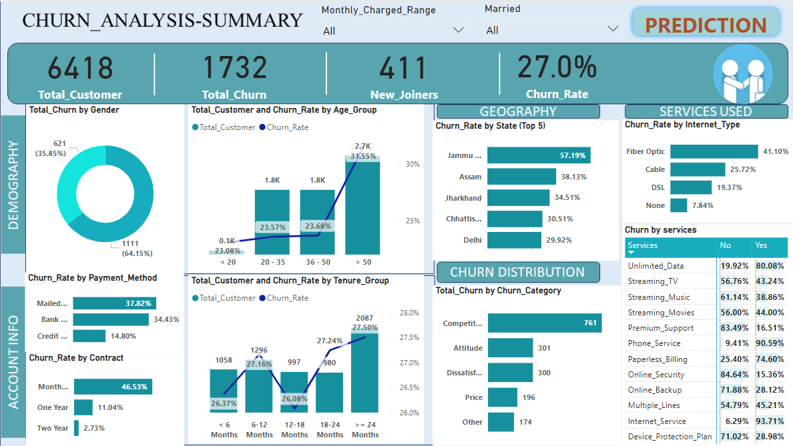

# Customer_Churn_Analysis

# Overview
<br>
This project aims to predict customer churn using a machine learning model. Churn prediction is crucial for businesses to identify customers who are likely to leave and take proactive measures to retain them. This project includes data visualization, data preprocessing, model building, evaluation and prediction of churner profiles.
<br>
# Dataset Description
<br>
 This dataset includes comprehensive information about customer demographics, service usage patterns, and billing details, which are used to predict customer churn. Below is a detailed description of each column in the dataset:
<br>
Columns
<br>
Customer_ID: Unique identifier for each customer.
<br>
Gender: Gender of the customer (e.g., Male, Female).
<br>
Age: Age of the customer.
<br>
Married: Marital status of the customer (e.g., Yes, No).
<br>
State: State where the customer resides.
<br>
Number_of_Referrals: Number of referrals made by the customer.
<br>
Tenure_in_Months: Duration of the customer's subscription in months.
<br>
Value_Deal: Indicates whether the customer is on a value deal (e.g., Yes, No).
<br>
Phone_Service: Indicates if the customer has a phone service (e.g., Yes, No).
<br>
Multiple_Lines: Indicates if the customer has multiple phone lines (e.g., Yes, No).
<br>
Internet_Service: Indicates if the customer has internet service (e.g., Yes, No).
<br>
Internet_Type: Type of internet service (e.g., DSL, Fiber optic, None).
<br>
Online_Security: Indicates if the customer has online security add-on (e.g., Yes, No).
<br>
Online_Backup: Indicates if the customer has online backup add-on (e.g., Yes, No).
<br>
Device_Protection_Plan: Indicates if the customer has a device protection plan (e.g., Yes, No).
<br>
Premium_Support: Indicates if the customer has premium technical support (e.g., Yes, No).
<br>
Streaming_TV: Indicates if the customer has streaming TV service (e.g., Yes, No).
<br>
Streaming_Movies: Indicates if the customer has streaming movies service (e.g., Yes, No).
<br>
Streaming_Music: Indicates if the customer has streaming music service (e.g., Yes, No).
<br>
Unlimited_Data: Indicates if the customer has an unlimited data plan (e.g., Yes, No).
<br>
Contract: Type of contract (e.g., Month-to-Month, One Year, Two Year).
<br>
Paperless_Billing: Indicates if the customer uses paperless billing (e.g., Yes, No).
<br>
Payment_Method: Payment method used by the customer (e.g., Bank transfer, Credit card, Electronic check, Mailed check).
<br>
Total_Charges: Total amount charged to the customer.
<br>
Monthly_Charges: Monthly charges for the customer.
<br>
Total_Revenue: Total revenue generated by the customer.
<br>
Churn_Category: Category of churn reason (e.g., Competitor, Dissatisfaction, Other).
<br>
Churn_Reason: Specific reason for churn (e.g., Competitor offered higher speeds, Price too high).
<br>
Customer_Status: Target variable for prediction(Churned,Stayed,Joined) 
<br>
<b>Target Variable</b>

Customer_Status: The target variable for the prediction model. It indicates whether a customer has churned (1) or stayed (0).

# Data Exploration 
<br>
The SQL operations performed on the stg_Churn table for exploratory data analysis, null value handling, data cleaning, and preparing data for visualization. The steps include checking distinct values, identifying nulls, removing nulls, and creating views for use in Machine learning model training.
<br>
Exploratory Data Analysis

```sql
--Gender Distribution

select Gender, count(Gender) as Totalcount,
count(Gender) * 100.00 / ( select count(*) from Stg_churn) as percentage
from Stg_churn
group by Gender;

-- Contract Types Distribution:

select Contract, count(Contract) as Totalcount,
count (Contract) * 100.0 / ( Select count (* ) from Stg_churn) as percentage
from Stg_churn
group by Contract;


-- Customer Status and Revenue Distribution:

select Customer_Status, count(Customer_Status) as totalcount,
sum(Total_Revenue) as Totalrev,
sum(Total_Revenue) * 100.0 / ( Select sum(Total_Revenue) from Stg_churn) as Revpercentage
from Stg_churn
group by Customer_Status;

-- State Distribution:

SELECT State, Count(State) as TotalCount,
Count(State) * 1.0 / (Select Count(*) from stg_Churn)  as Percentage
from Stg_Churn
Group by State
Order by Percentage desc
```
<br>
<b> the the sql file for complete code</b><br>
* Check Null Values
* Remove Null Values and Insert Clean Data
* Create Views for Power BI

# Churn Analysis Summary (Summary.png)


[Link to PowerBI Dashboard](https://app.powerbi.com/links/pSHktEcXVV?ctid=a8eec281-aaa3-4dae-ac9b-9a398b9215e7&pbi_source=linkShare)
<br>
Churn by Gender: 35.85% of males and 64.15% of females churn.<br>
Churn by Payment Method: Mailed check users have the highest churn rate (37.82%).<br>
Churn by Contract: Month-to-month contract holders have the highest churn rate (46.53%).<br>
Churn by Age Group: Customers aged > 50 have the highest churn rate (31.55%).<br>
Churn by Tenure Group: Customers with tenure of 18-24 months have the highest churn rate (27.50%).<br>
Churn by State: Jammu & Kashmir has the highest churn rate (57.19%).<br>
Churn by Internet Type: Fiber optic users have the highest churn rate (41.10%).<br>
Churn by Services Used: Customers using multiple services and online backup have higher churn rates.<br>

# Model Building
Data Preprocessing

The data preprocessing steps include:

Loading Data: Reading data from an Excel file.<br>
Dropping Unnecessary Columns: Removing columns that are not needed for prediction.<br>
Label Encoding: Encoding categorical variables.<br>
Scaling: Standardizing the features.<br>

# Model Training
Two machine learning models were trained:

# Logistic Regression: (Accuracy : 79% )

Trained with increased iterations and scaled data.<br>
Hyperparameter tuning using GridSearchCV.<br>

# Random Forest: (Accuracy: 85% )

Trained with default parameters.<br>
Hyperparameter tuning using GridSearchCV.<br>

<b>Evaluation</b>
The models were evaluated using the following metrics:<br>
Confusion Matrix: To visualize the performance of the models.<br>
Classification Report: To get precision, recall, and F1-score.<br>
<br>

# findings from the Dashboards
<b>Predicted Churner Profile (Prediction1.png)</b>


[Link to power BI Dashboard](https://app.powerbi.com/links/pSHktEcXVV?ctid=a8eec281-aaa3-4dae-ac9b-9a398b9215e7&pbi_source=linkShare&bookmarkGuid=253bca62-337b-4265-8395-486c45276961)
<br>
Gender: 134 males and 245 females are predicted to churn.<br>
Age Group: Most churners are in the 20-35 and 36-50 age groups.<br>
Marital Status: 194 married and 185 single customers are predicted to churn.<br>
State: Uttar Pradesh, Maharashtra, and Tamil Nadu have the highest number of predicted churners.<br>
Tenure Group: Most churners have a tenure of 6-12 months or more than 24 months.<br>
Payment Method: Credit card is the most common payment method among predicted churners.<br>
Contract: Month-to-month contracts have the highest churn rate.<br>
<br>

# Conclusion
<br>
The project successfully predicts customer churn and provides valuable insights into the factors contributing to churn. The Random Forest model performed better than the Logistic Regression model. The dashboards offer a comprehensive view of the churn analysis, helping stakeholders make informed decisions to reduce churn.
<br>